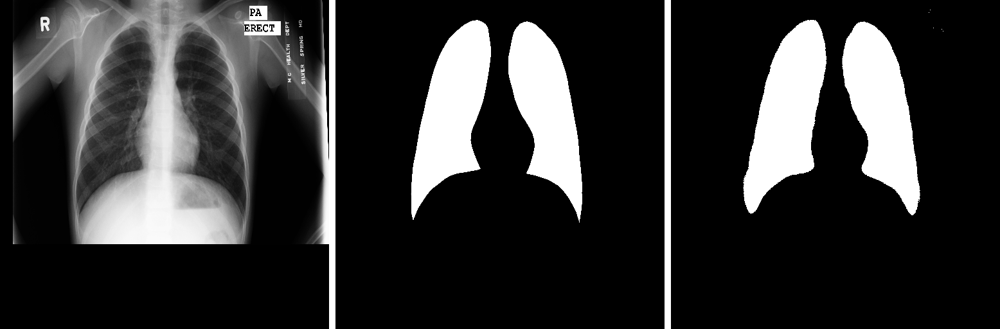
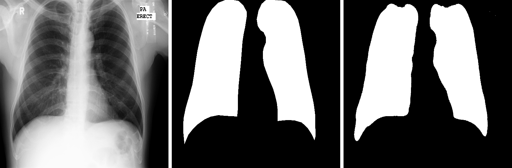

# UNET
UNet is a popular architecture in computer vision for image segmentation tasks. Its name comes from its U-shaped architecture, which consists of a contracting path (encoder) and an expansive path (decoder). UNet is widely used because it effectively captures both local and global information, making it suitable for tasks like medical image segmentation and object detection. Its symmetric design helps in preserving spatial information and addressing the challenge of class imbalance in segmentation tasks

# Why we used unet for medical image analysis?
UNet is commonly used for medical image analysis due to several reasons:

### High Performance: 
UNet has demonstrated high performance in medical image segmentation tasks. Its architecture allows it to capture intricate details in images, making it suitable for identifying structures or abnormalities in medical images.

### Semantic Segmentation:
Medical image analysis often involves segmenting specific structures or regions of interest within an image. UNet's architecture, with its contracting and expanding paths, is well-suited for semantic segmentation tasks where precise delineation of structures is crucial.

### Limited Data: 
Medical datasets are often limited in size, and UNet performs well with small datasets. Transfer learning and data augmentation techniques can be effectively applied to boost performance even when training data is scarce.

### Adaptability: 
UNet can be adapted to different medical imaging modalities, such as MRI, CT scans, or X-rays. Its flexibility makes it applicable to various medical image analysis scenarios.

### Architectural Features: 
The skip connections in UNet enable the model to retain high-resolution details during the downsampling and upsampling processes. This helps in preserving spatial information, which is essential in medical imaging.

### Open-Source Implementations: 
There are numerous open-source implementations of UNet available, making it easier for researchers and practitioners in the medical field to access and implement the architecture in their work.

# How to deployed unet model ?
Deploying a UNet model involves several steps. Here's a general guide:

Train and Save the Model:

### Train your UNet model on the desired dataset.
Save the trained model weights and architecture to a file. Common formats include TensorFlow's SavedModel format or the HDF5 format.

### Choose Deployment Platform:
Decide where you want to deploy your model. Options include cloud platforms like AWS, Azure, or Google Cloud, or on-premises servers.

### Build Inference Pipeline:

Create an inference pipeline to process input data and obtain predictions from your UNet model. This may involve pre-processing steps to prepare input data for the model.

### Choose Deployment Framework:
Choose a deployment framework suitable for your chosen platform. TensorFlow Serving, ONNX Runtime, and Flask are popular choices for deployment.

### Containerization (Optional):
Containerize your model using Docker. This allows you to encapsulate your model, its dependencies, and the inference pipeline into a container that can be easily deployed and run consistently across different environments.

### Deploy on Cloud:
If using a cloud platform, follow the platform-specific instructions for deploying machine learning models. Many cloud providers offer specialized services for deploying and serving machine learning models, such as AWS SageMaker, Azure Machine Learning, or Google AI Platform.

### REST API (Optional):
Expose your model through a REST API if you want to make predictions over HTTP. Flask or FastAPI are commonly used for creating API endpoints.

### Monitoring and Scaling:
Implement monitoring to keep track of the model's performance and usage. Consider scaling solutions based on your deployment requirements, such as load balancing for high demand.
Security Considerations:

Implement security measures to protect your deployed model, especially if it involves handling sensitive medical data. Use authentication and encryption where necessary.

### Testing:
Thoroughly test the deployed model to ensure that it works as expected in the production environment.
Remember that deployment specifics may vary depending on the platform and tools you choose. Always refer to the documentation provided by the deployment framework and platform for the most accurate and up-to-date instructions.

### Dataset link :- https://academictorrents.com/details/ac786f74878a5775c81d490b23842fd4736bfe33

# Overview
- Architecture
- Results

# Architecture
The block diagram of the UNET architecture taken from the original paper.

|  |
| :--: |
| *U-Net Architecture* |

## For installion
The install following libraries:
tensorflow
glop
Panda
Numpy
sk-learn

1. Clone this repository to your local machine.

    ```bash
    git clone https://github.com/kartikshastrakar/UNET
    cd UNET
    ```

2. Create a Python virtual environment (optional but recommended):

    ```bash
    python -m venv venv
    source venv/bin/activate  On Windows, use: venv\Scripts\activate
    ``
3. Run python Scripts
   ```
   python train.py
   python model.py

   ```  

# Results
The images below contains:
1. Input image
2. Ground truth 
3. Predicted mask

|  |
| :--: |
|  |
|  |
|  |
